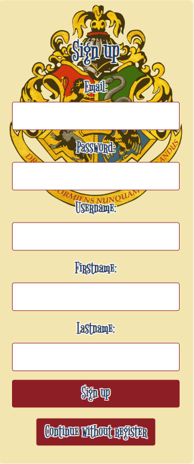
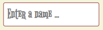
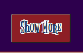
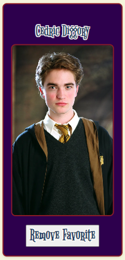
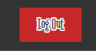

# FS-Final-Proyect-Bootcamp

Welcome to Harry Potter V2.0 app!

This time i have developed the project in React (Front-End) and its comunicates with my API REST done with Express Node.Js (Back-End)

Let me introduce how the navigation process works -->

Home:

    Once you get in the home you may be able to sign up and therefore login, i strongly recommend you to do this in order to fully navigate through it.

    However feel free to navigate without registration process if you don't feel to:

Header:

    You may be able to go forward or backwards by using the navbar i've done, here it is:

Search Harry Potter Info:

    There are 2 ways to filter the characters and it would be easier for you to find which one are you looking for -->

        1. There is an input text right bellow the navbar, you can enter a name and it will find you the character:

        2. I've created a filter where you can look for a group of characters depending if you are looking for the house they belong, or if its either a student or staff in Hogwarts

    Every Card has a button call "show more" if you click on it more info about the character will be shown, so if you want to know more details about them dont hesitate to click on it !

    If you are login into the application you will be able to see another button right besides the show more, this button is call "add to favorites"

        If you click on this button it will add the character/s to a SQL DDBB connected to the React proyect where you can storage your favorites ones!

    Once you have saved some favorite characters i suggest you to go forward "check your favorites" in the navbar in order to see which ones have you saved

        In case you dont feel anymore that you want to save the character no more just click in "remove favorite" and it will be delete from the Data Base and you should not see it anymore in that view

    Last step, in the footer i have created a log out button always available for logged users, feel free to click on it if you no longer wish to be logged in

To start the project once you have cloned the repository (in case you want to test it) you must install the dependencies, use the following command in your terminal:

npm run install This will install everything necessary for the project to start!

Then use the following command to start the project:

npm run dev Now you will be able to browse the following port set in your locale:

    http://localhost:5173/

This Harry Potter Fan Site is using the following technologies -->

    - Front-End : Vite (React), Sass (CSS), Jest/Vitest, Js-cookie / React-jwt, Axios, React Hook Form among others...

    - Back-End : Express, Node.JS, SQL DDBB, ElephantSQL, PostgreSQL, Helmet, Cors, Bcrypt, Cookie-parser, Express-session, Json Web Token, Passport...

And i will keep updating adding even more things i have in mind to come -->

    - Redux
    - Testing Jest (Already has a Component test but currently is unavailable)
    - Admin Role to manage users